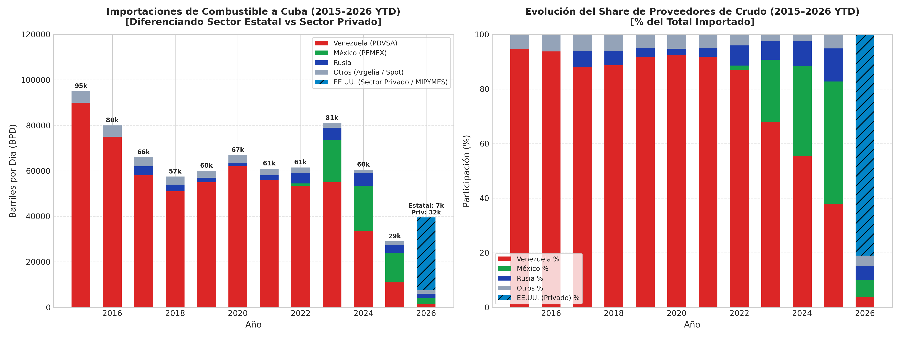
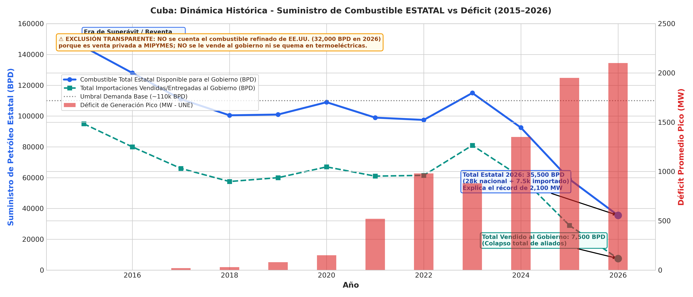
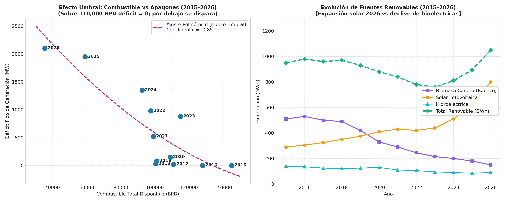

# Informe Histórico Extendido: Dinámica Energética en Cuba (2015–2026 YTD)

## 1. Resumen Ejecutivo y Conclusiones del Ciclo Completo de 12 Años

Este informe analiza cuantitativa y cualitativamente la trayectoria de los envíos de petróleo a Cuba, la generación eléctrica y el déficit del Sistema Electroenergético Nacional (SEN) durante un periodo de 12 años (2015 a 2026 YTD).

### Conclusiones Fundamentales:
1. **La "Era de Excedente y Reventa Oficial" (2015–2018):** 
   - Durante 2015–2016, Cuba recibía entre 75,000 y 90,000 barriles diarios (BPD) de crudo y productos de PDVSA, que sumados a ~50,000 BPD de extracción nacional aportaban **128,000 a 145,000 BPD disponibles**, frente a una demanda base de ~110,000 BPD.
   - Con este superávit, **el déficit eléctrico nacional era de 0 MW**. 
   - En este periodo, Cuba procesaba legalmente crudo en la refinería mixta *Cuvenpetrol* (Cienfuegos) y reexportaba derivados (naftas, búnker marino y fuel oil) hacia el Caribe y Centroamérica para ingresar cientos de millones de dólares a las arcas estatales.

2. **El "Efecto Umbral" (110,000 BPD):**
   - El cruce de datos a 12 años demuestra que la relación entre petróleo disponible y apagones **no es lineal, sino que sigue un modelo de umbral polinómico**.
   - Por encima de 110,000 BPD, el sistema cubano cuenta con suficiente combustible para sus plantas térmicas y grupos electrógenos, manteniendo el déficit en cero o niveles despreciables (<50 MW).
   - Por debajo de 110,000 BPD, el sistema se degrada rápidamente y entra en zona crítica al perforar los 80,000 BPD, donde la falta de combustible paraliza los grupos diésel de respaldo y los apagones se vuelven masivos.

3. **La Transición a la Reventa Clandestina y Desvío Interno (2019–2025):**
   - Tras el endurecimiento de sanciones a petroleros en 2019 y la caída de la producción de PDVSA, Cuba perdió el superávit operativo.
   - Pese a ello, para mantener el flujo de divisas de GAESA, el Estado priorizó el desvío de los mejores crudos (ligeros de México y Venezuela) hacia Cienfuegos para venta en divisas (turbocombustible a aerolíneas, búnker internacional y servicentros dolarizados), además de reexportar cargamentos en esquemas de triangulación buque a buque hacia Asia (denunciados en hasta el 60% en periodos de 2024–2025).

4. **El Gran Giro Geopolítico de 2026 y la Separación Estado vs Sector Privado:**
   - La captura de Nicolás Maduro en enero de 2026 cortó el suministro venezolano (que cayó a niveles residuales de ~1,500 BPD).
   - México redujo drásticamente sus entregas bajo presión comercial de EE.UU. (a 2,500 BPD).
   - **El combustible importado vendido al gobierno cubano se desplomó a solo 7,500 BPD**. Sumado al crudo nacional (28,000 BPD), el Estado solo dispuso de **35,500 BPD** para sostener el país y la red eléctrica.
   - **Ventas comerciales de EE.UU. (~32,000 BPD):** Entran bajo licencias comerciales para el sector privado / MIPYMES (gasolina y diésel automotriz). **NO se le venden al gobierno ni pueden quemarse en termoeléctricas**. Para evitar cualquier distorsión o engaño, este volumen se excluye por completo de la gráfica frente al déficit.
   - El colapso del combustible estatal a 35,500 BPD explica matemáticamente por qué el déficit eléctrico nacional superó los **2,100 MW pico**, dejando sin luz a más del 65% del país simultáneamente.

---

## 2. Matriz Histórica de Datos (2015–2026 YTD)

| Año | Venezuela (BPD) | México (BPD) | EE.UU. (BPD) | Rusia (BPD) | Otros (BPD) | Total Imp. (BPD) | Crudo Nac. (BPD) | Total Disp. (BPD) | Gen. Bruta (GWh) | Renovables (GWh) | Déficit Pico (MW) |
|:---:|:---:|:---:|:---:|:---:|:---:|:---:|:---:|:---:|:---:|:---:|:---:|
| **2015** | 90,000 | 0 | 0 | 0 | 5,000 | **95,000** | 50,000 | **145,000** | 20,123.0 | 950 | 0 |
| **2016** | 75,000 | 0 | 0 | 0 | 5,000 | **80,000** | 48,000 | **128,000** | 20,245.0 | 980 | 0 |
| **2017** | 58,000 | 0 | 0 | 4,000 | 4,000 | **66,000** | 45,000 | **111,000** | 20,558.1 | 960 | ~20 |
| **2018** | 51,000 | 0 | 0 | 3,000 | 3,500 | **57,500** | 43,000 | **100,500** | 20,837.0 | 970 | ~30 |
| **2019** | 55,000 | 0 | 0 | 2,000 | 3,000 | **60,000** | 41,000 | **101,000** | 20,622.0 | 930 | ~80 |
| **2020** | 62,000 | 0 | 0 | 1,500 | 3,500 | **67,000** | 42,000 | **109,000** | 19,070.9 | 880 | ~150 |
| **2021** | 56,000 | 0 | 0 | 2,000 | 3,000 | **61,000** | 38,000 | **99,000** | 17,965.5 | 840 | ~520 |
| **2022** | 53,500 | 1,000 | 0 | 4,500 | 2,500 | **61,500** | 36,000 | **97,500** | 15,732.1 | 780 | ~980 |
| **2023** | 55,000 | 18,500 | 0 | 5,500 | 2,000 | **81,000** | 34,000 | **115,000** | 15,331.1 | 760 | ~880 |
| **2024** | 33,500 | 20,000 | 0 | 5,500 | 1,500 | **60,500** | 32,000 | **92,500** | 14,344.9 | 810 | ~1,350 |
| **2025** | 11,000 | 13,000 | 0 | 3,500 | 1,500 | **29,000** | 30,000 | **59,000** | 12,200.0 | 895 | ~1,950 |
| **2026 YTD**| 1,500 | 2,500 | 32,000 (Privado)* | 2,000 | 1,500 | **7,500 (Estatal)** | 28,000 | **35,500 (Estatal)** | 11,400.0 (proj) | 1,050 | ~2,100 |

*\*Nota de Transparencia 2026: Los 32,000 BPD de EE.UU. corresponden al sector privado (MIPYMES) y NO entran al Sistema Electroenergético Nacional (SEN) ni se le venden al gobierno. El Estado solo cuenta con 35,500 BPD para la red nacional.*

---

## 3. Gráficas Históricas Generadas

### 1. Importaciones por País y Cuota de Mercado (2015–2026)

### 2. Suministro Total vs Déficit de Generación (Efecto Umbral de 110k BPD)

### 3. Modelo de Dispersión Polinómico y Evolución de Fuentes Renovables

---

## 4. Comparativa Entre Eras

| Aspecto | Era de Bonanza (2015–2018) | Era del Colapso (2019–2026 YTD) |
|:---|:---|:---|
| **Suministro Medio de Crudo** | ~121,000 BPD | ~88,000 BPD (con mínimos de 59,000 BPD) |
| **Déficit Medio en Horario Pico** | 0 – 30 MW (Inexistente) | 500 – 2,100 MW (Crónico y Generalizado) |
| **Generación Eléctrica Anual** | ~20,500 GWh | ~11,400 – 15,000 GWh (Caída del 45%) |
| **Mecanismo de Reventa** | Reexportación formal de refinados en Cuvenpetrol | Arbitraje clandestino buque a buque (China/Asia) y venta en divisas locales (búnker/MLC) |
| **Proveedor Dominante** | Venezuela (PDVSA) con más del 90% | Fragmentado: México (2023-2025), EE.UU. (2026) |
| **Estado Termoeléctrico** | Desgaste moderado, capacidad nominal disponible | Envejecimiento terminal (>40 años), fallas estructurales por corrosión de azufre |
